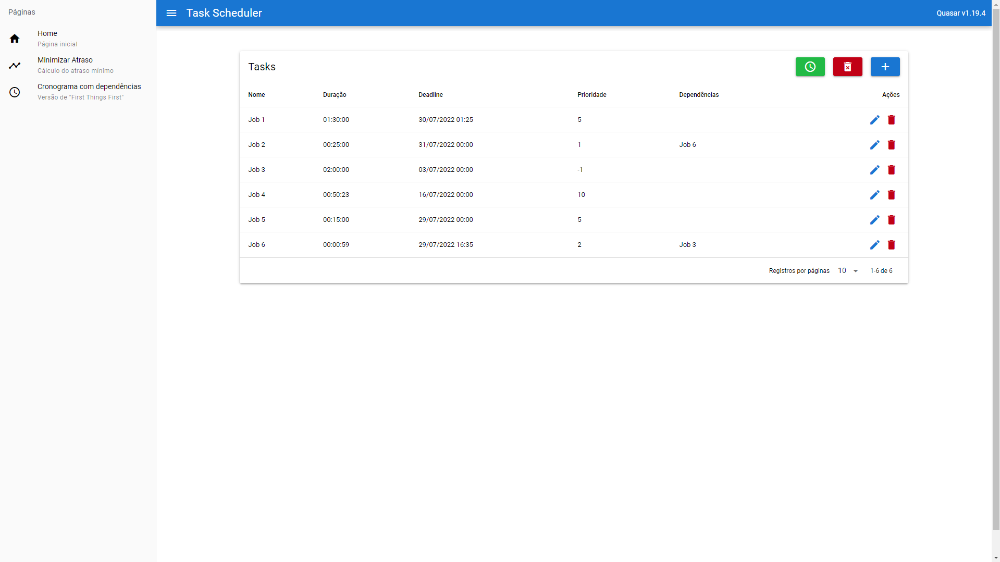
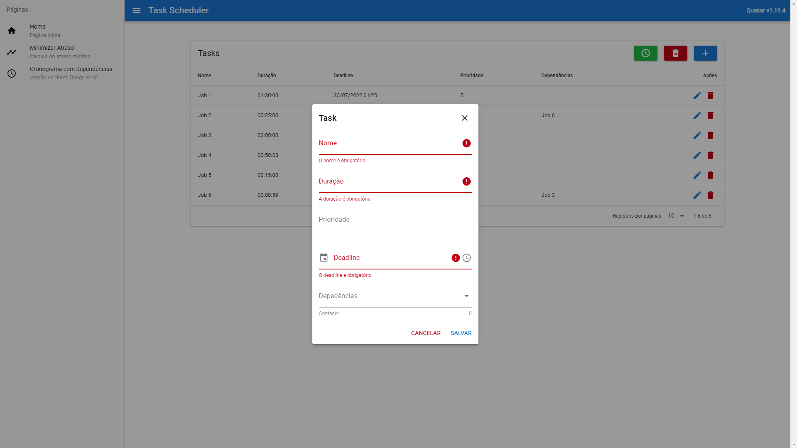
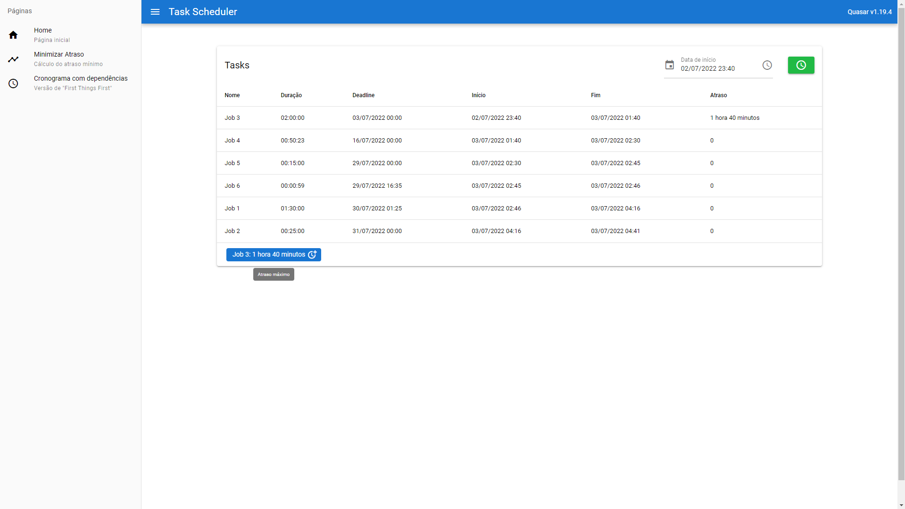

# Task Scheduler

**Conteúdo da Disciplina**: Greed<br>

## Alunos
| Matrícula | Aluno |
| -- | -- |
| 18/0018728  |  Igor Batista Paiva |
| 18/0028260  |  Thiago Aparecido Lopes Santos |

## Sobre
O Task Scheduler é um software criado para agendar tarefas que pode se utilizar de parâmetros como o deadline, prioridade e dependência para listar qual seria a melhor ordem de execução dessas tarefas.

No software, existem duas opções de organização das tarefas, sendo elas:
 - Minimizar Atraso (*Minimize Lateness*):
 Nessa opção, as tarefas são organizadas de maneira a se ter o menor atraso máximo possível, evitando ao máximo portanto, atrasos longos na execução das tarefas. Dessa maneira, as tarefas são ordenadas de acordo com o seu deadline, do menor, para o maior.

 - Cronograma com dependências:
 Essa opção foi baseada em uma técnica de priorização de requisitos de software chamada [*First Things First*](https://www.processimpact.com/articles/prioritizing.pdf), e leva em consideração não somente o deadline, como também a prioridade e as dependências das tarefas designadas, trazendo as atividades em ondas.

O vídeo da apresentação pode ser encontrado clicando [aqui](https://github.com/projeto-de-algoritmos/Greed_TaskScheduler/blob/4bfd2ae72e1335650189fee74f18c076e37b66bd/apresentacao.mp4?raw=true).

## Screenshots

### Página Inicial


### Modal de criação de nova tarefa


### Minimize Lateness Scheduler


### Scheduler alternativo (*First Things First*)


## Instalação
**Linguagem**: JavaScript<br>
**Framework**: Vue.JS<br>
Para executar, primeiramente é necessário ter o [yarn](https://classic.yarnpkg.com/lang/en/docs/install) instalado.

Posteriormente, execute:

```
yarn
```

para a instalação das dependências e:

```
yarn quasar dev
```

para iniciar o projeto.

## Uso
Na página inicial, clique no ícone (+) para adicionar uma nova task. Insira os dados obrigatórios (nome, duração e deadline) e opcionais (prioridade e dependências) caso necessário, e clique em salvar para adicionar uma nova tarefa. Todas as tarefas podem ser editadas ou apagadas clicando no ícone correspondente na tabela. Para excluir todas tarefas, basta clicar no ícone de lixeira no canto superior direito da tabela.

Na página "Minimizar Atraso", preencha a data de início para a execução das tasks, e depois clique no ícone do relógio para montar o agendamento.

Na página "Cronograma com dependências", basta acessar a página, e o agendamendo será gerado.
